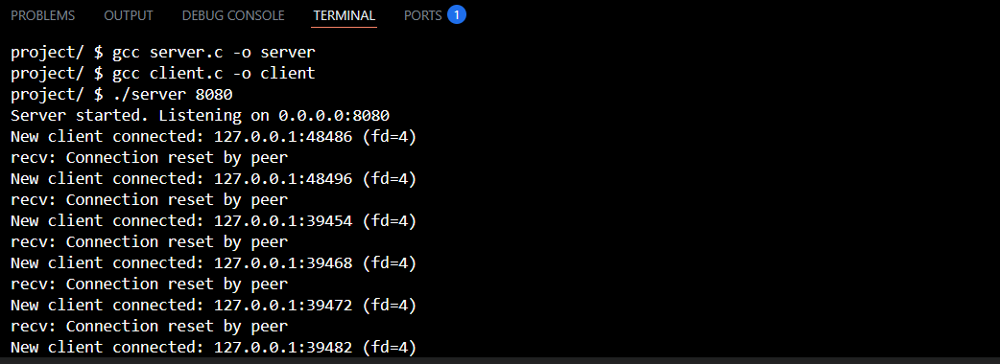
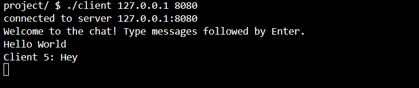
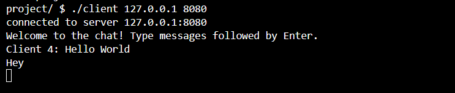

# Chat Application in C


## Overview
This project is my final submission for **CS50x**.
I built a simple **1-on-1 chat application** in C using **sockets** to handle network communication. The goal was a functional client-server chat where two ends can exchange messages back and forth over a single TCP connection.

The project consists of two main programs:
- **Server** – Listens on a chosen port, accepts a single client connection, and exchanges messages with it.
- **Client** – Connects to the server and allows a user to send and receive messages.

The two sides take turns: the client sends a message first, the server reads it and replies, and so on, alternating until either side sends `Bye`. This taught me a lot about basic socket setup, blocking I/O, and low-level network programming in C.

---

## Features
- Written entirely in **C**, which helped me strengthen my understanding of pointers, structs, and memory management.
- Uses **TCP sockets** for reliable communication.
- Handles a single client connection per server run, exchanging messages turn-by-turn.
- Handles disconnection gracefully (either side sending `Bye`, or the socket closing), avoiding crashes.
- Comes with a simple terminal interface (with the option to extend using **ncurses** for a better UI).
- Cross-platform: runs on both **Linux/macOS** (POSIX sockets) and **Windows** (Winsock2), using conditional compilation (`#ifdef _WIN32`).

---

## Files
- `server.c` → Starts the server, listens for incoming connections, and relays messages.
- `client.c` → Connects to the server and allows chatting from the terminal.
- `README.md` → Documentation for the project (this file).

---

## Design Choices
I debated a few design choices while building this project:

1. **TCP vs UDP** – I chose TCP for reliable delivery of messages. I wanted to make sure that no messages get lost, which is critical for chat applications.
2. **Single connection, blocking I/O** – Rather than handling multiple clients with `select()` or a thread per connection, I kept it simple: the server accepts one client and both sides use blocking `recv`/`send` calls, alternating turns. This avoided synchronization and concurrency concerns entirely, though it means only one client can be connected at a time. Extending this to multiple simultaneous clients (via `select()` or threads) is a natural next step.
3. **Terminal interface** – I decided to start with a simple text-based interface first. Using **ncurses** can improve the UI later, but my focus was on network functionality.
4. **Message protocol** – Messages are plain text terminated by `\n`. I considered using a binary protocol, but keeping it human-readable made debugging much easier.
5. **Cross-platform sockets** – The POSIX sockets API (`sys/socket.h`, `unistd.h`) and Windows' Winsock2 API (`winsock2.h`) aren't identical, so I used `#ifdef _WIN32` blocks to switch between them at compile time. This meant handling a few key differences: Winsock requires an explicit `WSAStartup()`/`WSACleanup()` to initialize and tear down the socket library, and Windows uses `closesocket()` instead of the POSIX `close()`.

Building this project helped me learn the importance of handling partial reads/writes, client disconnections, and proper socket cleanup. I also gained practical experience with error handling and debugging in networked programs.

---

## How to Compile

### Linux / macOS
Compile both programs using `gcc`:

```bash
gcc server.c -o server
gcc client.c -o client
```

### Windows
Using **MinGW** (or another GCC toolchain), link against the Winsock library with `-lws2_32`:

```bash
gcc server.c -o server.exe -lws2_32
gcc client.c -o client.exe -lws2_32
```

Alternatively, you can build with MSVC (`cl.exe`) from a Developer Command Prompt:

```bash
cl server.c ws2_32.lib
cl client.c ws2_32.lib
```

---

## How to Run

### Start the Server
Run the server on a chosen port (use a port number higher than 1024):

```bash
# Linux / macOS
./server 8080

# Windows
server.exe 8080
```

### Start the Client
```bash
# Linux / macOS
./client 127.0.0.1 8080

# Windows
client.exe 127.0.0.1 8080
```

## Demo / Screenshots

### Server Running


### Client Communication
| Client 1 | Client 2 |
| :---: | :---: |
|  |  |

### Personal Notes

While working on this project, I learned a lot about networking basics and C programming. Getting the client and server to reliably exchange messages back and forth was challenging at first, but seeing it work smoothly was very rewarding. This project gave me confidence to tackle more advanced networked applications in the future.